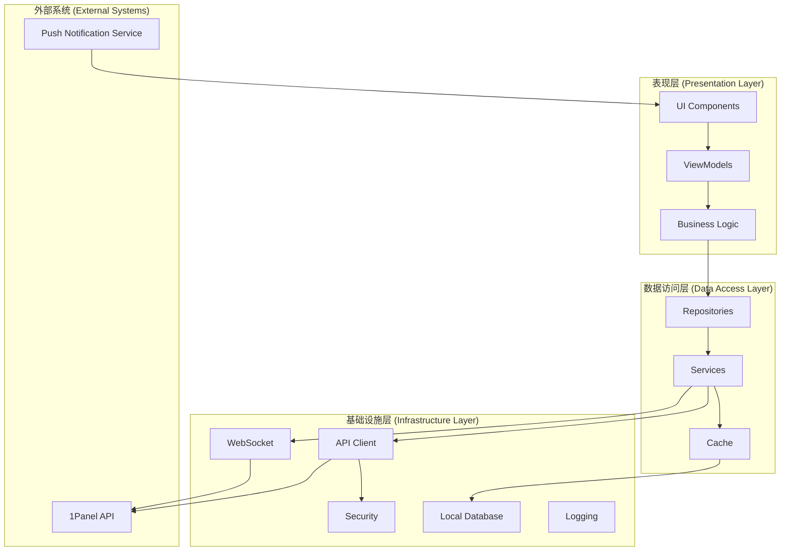
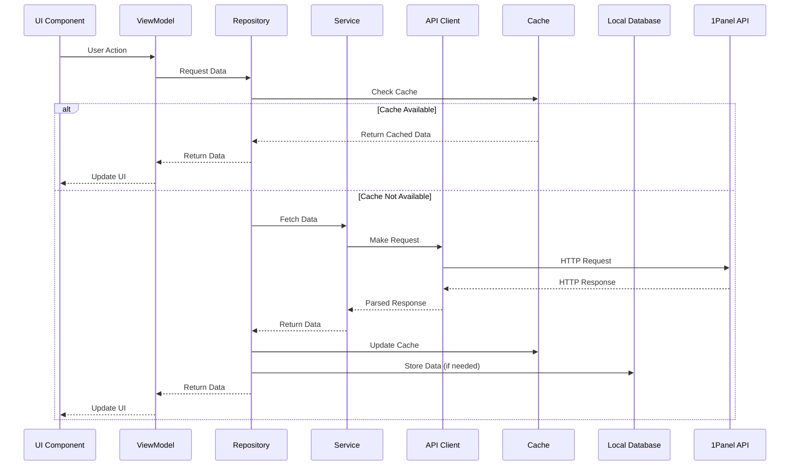
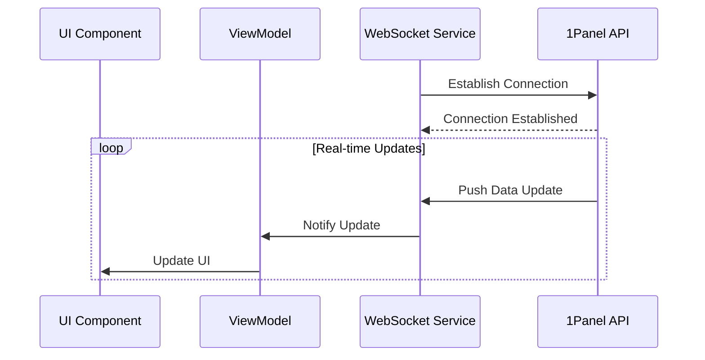
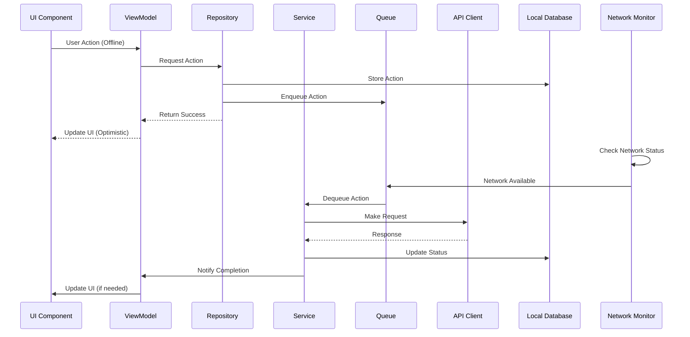

# 1Panel 移动端APP - 技术架构文档

## 1. 概述

本文档详细描述了1Panel移动端APP的技术架构，包括整体架构设计、技术栈选择、模块划分、数据流、安全架构、性能优化策略等内容。该应用基于Flutter和Material You Design 3开发，用于管理1Panel Linux服务器面板。

## 2. 整体架构设计

### 2.1 架构模式

1Panel移动端APP采用**分层架构**和**MVVM（Model-View-ViewModel）**模式相结合的设计，确保代码的可维护性、可测试性和可扩展性。

#### 2.1.1 分层架构

应用分为以下四个主要层次：

1. **表现层（Presentation Layer）**：负责UI展示和用户交互
2. **业务逻辑层（Business Logic Layer）**：处理应用的业务逻辑
3. **数据访问层（Data Access Layer）**：负责与数据源交互
4. **基础设施层（Infrastructure Layer）**：提供基础服务和工具

#### 2.1.2 MVVM模式

在表现层内部，采用MVVM模式进行组织：

- **Model（模型）**：表示数据和业务逻辑
- **View（视图）**：负责UI展示和用户交互
- **ViewModel（视图模型）**：连接Model和View，处理UI逻辑和状态

### 2.2 架构图

## 3. 技术栈选择

### 3.1 前端技术栈

| 技术 | 版本 | 用途 | 选择理由 |
|------|------|------|----------|
| Flutter | 3.16+ | 跨平台移动应用开发框架 | 高性能、跨平台、丰富的UI组件、热重载 |
| Dart | 3.2+ | 编程语言 | 类型安全、高性能、与Flutter完美集成 |
| Material You Design 3 | - | UI设计系统 | 现代化设计、动态颜色、自适应UI |
| Provider | 6.1+ | 状态管理 | 简单易用、与Flutter集成良好 |
| GoRouter | 12.1+ | 路由管理 | 声明式路由、深度链接支持 |
| Dio | 5.4+ | HTTP客户端 | 功能丰富、拦截器支持、取消请求 |
| Hive | 2.2+ | 本地数据库 | 轻量级、高性能、无需原生依赖 |
| Flutter Bloc | 8.1+ | 状态管理（复杂场景） | 可预测的状态管理、强大的开发者工具 |
| WebSocket | - | 实时通信 | 双向通信、实时数据更新 |
| Flutter Local Notifications | 16.3+ | 本地通知 | 丰富的通知功能、跨平台支持 |

### 3.2 开发工具

| 工具 | 用途 |
|------|------|
| Visual Studio Code | 主要开发环境 |
| Android Studio | Android开发和调试 |
| Xcode | iOS开发和调试 |
| Flutter DevTools | 性能分析和调试 |
| Git | 版本控制 |
| Postman | API测试 |
| Figma | UI设计 |

### 3.3 测试工具

| 工具 | 用途 |
|------|------|
| Flutter Test | 单元测试和组件测试 |
| Integration Test | 集成测试 |
| Mockito | 模拟依赖 |
| Test Lab | 设备测试 |

## 4. 模块划分

### 4.1 核心模块

#### 4.1.1 认证模块（Auth Module）

**职责**：处理用户认证和授权

**组件**：
- `AuthService`：处理登录、注销、令牌刷新
- `AuthRepository`：管理认证数据
- `AuthViewModel`：处理认证UI逻辑
- `LoginPage`：登录页面
- `BiometricAuth`：生物识别认证

**依赖**：
- `ApiClient`：用于API调用
- `SecureStorage`：用于安全存储令牌
- `LocalDatabase`：用于缓存用户信息

#### 4.1.2 网络模块（Network Module）

**职责**：处理所有网络请求和响应

**组件**：
- `ApiClient`：HTTP客户端封装
- `ApiInterceptor`：请求拦截器（添加认证头、错误处理）
- `WebSocketService`：WebSocket连接管理
- `NetworkMonitor`：网络状态监控

**依赖**：
- `Dio`：HTTP客户端
- `ConnectivityPlus`：网络状态检测
- `Logger`：日志记录

#### 4.1.3 数据模块（Data Module）

**职责**：管理应用数据和状态

**组件**：
- `Repository`：数据访问抽象
- `LocalDatabase`：本地数据库
- `CacheManager`：缓存管理
- `DataSyncService`：数据同步服务

**依赖**：
- `Hive`：本地数据库
- `SharedPreferences`：简单数据存储
- `PathProvider`：文件路径管理

#### 4.1.4 UI模块（UI Module）

**职责**：提供通用UI组件和主题

**组件**：
- `AppTheme`：应用主题（包括Material You Design 3）
- `CommonWidgets`：通用UI组件
- `ResponsiveUtils`：响应式设计工具
- `AnimationUtils`：动画工具

**依赖**：
- `Flutter`：UI框架
- `Material`：Material Design组件
- `Lottie`：动画

### 4.2 功能模块

#### 4.2.1 仪表盘模块（Dashboard Module）

**职责**：展示系统概览和实时监控数据

**组件**：
- `DashboardService`：获取仪表盘数据
- `DashboardRepository`：管理仪表盘数据
- `DashboardViewModel`：处理仪表盘UI逻辑
- `DashboardPage`：仪表盘页面
- `SystemInfoWidget`：系统信息组件
- `ResourceMonitorWidget`：资源监控组件
- `ChartWidget`：图表组件

**依赖**：
- `Network Module`：获取数据
- `Data Module`：缓存数据
- `UI Module`：UI组件

#### 4.2.2 应用管理模块（App Management Module）

**职责**：管理服务器上的应用

**组件**：
- `AppService`：应用相关API调用
- `AppRepository`：管理应用数据
- `AppViewModel`：处理应用UI逻辑
- `AppListPage`：应用列表页面
- `AppDetailPage`：应用详情页面
- `AppInstallPage`：应用安装页面
- `AppSearchWidget`：应用搜索组件

**依赖**：
- `Network Module`：获取数据
- `Data Module`：缓存数据
- `UI Module`：UI组件

#### 4.2.3 容器管理模块（Container Module）

**职责**：管理Docker容器

**组件**：
- `ContainerService`：容器相关API调用
- `ContainerRepository`：管理容器数据
- `ContainerViewModel`：处理容器UI逻辑
- `ContainerListPage`：容器列表页面
- `ContainerDetailPage`：容器详情页面
- `ContainerLogPage`：容器日志页面
- `ContainerStatsWidget`：容器统计组件

**依赖**：
- `Network Module`：获取数据
- `Data Module`：缓存数据
- `UI Module`：UI组件

#### 4.2.4 网站管理模块（Website Module）

**职责**：管理网站和SSL证书

**组件**：
- `WebsiteService`：网站相关API调用
- `WebsiteRepository`：管理网站数据
- `WebsiteViewModel`：处理网站UI逻辑
- `WebsiteListPage`：网站列表页面
- `WebsiteDetailPage`：网站详情页面
- `WebsiteCreatePage`：网站创建页面
- `SSLManagerPage`：SSL管理页面

**依赖**：
- `Network Module`：获取数据
- `Data Module`：缓存数据
- `UI Module`：UI组件

#### 4.2.5 文件管理模块（File Module）

**职责**：管理服务器文件

**组件**：
- `FileService`：文件相关API调用
- `FileRepository`：管理文件数据
- `FileViewModel`：处理文件UI逻辑
- `FileBrowserPage`：文件浏览页面
- `FileUploadPage`：文件上传页面
- `FilePreviewPage`：文件预览页面
- `FileSearchWidget`：文件搜索组件

**依赖**：
- `Network Module`：获取数据
- `Data Module`：缓存数据
- `UI Module`：UI组件

#### 4.2.6 备份管理模块（Backup Module）

**职责**：管理备份和恢复

**组件**：
- `BackupService`：备份相关API调用
- `BackupRepository`：管理备份数据
- `BackupViewModel`：处理备份UI逻辑
- `BackupListPage`：备份列表页面
- `BackupCreatePage`：备份创建页面
- `BackupRestorePage`：备份恢复页面
- `BackupScheduleWidget`：备份计划组件

**依赖**：
- `Network Module`：获取数据
- `Data Module`：缓存数据
- `UI Module`：UI组件

### 4.3 工具模块

#### 4.3.1 日志模块（Logging Module）

**职责**：记录应用日志

**组件**：
- `Logger`：日志记录器
- `LogRepository`：管理日志数据
- `LogPage`：日志查看页面

**依赖**：
- `LocalDatabase`：存储日志
- `UI Module`：UI组件

#### 4.3.2 设置模块（Settings Module）

**职责**：管理应用设置

**组件**：
- `SettingsService`：设置管理服务
- `SettingsRepository`：管理设置数据
- `SettingsViewModel`：处理设置UI逻辑
- `SettingsPage`：设置页面

**依赖**：
- `LocalDatabase`：存储设置
- `UI Module`：UI组件

#### 4.3.3 通知模块（Notification Module）

**职责**：处理推送通知

**组件**：
- `NotificationService`：通知服务
- `NotificationRepository`：管理通知数据
- `NotificationHandler`：通知处理器

**依赖**：
- `Firebase Messaging`：推送通知
- `Local Notifications`：本地通知

## 5. 数据流

### 5.1 数据获取流程

### 5.2 实时数据更新流程

### 5.3 离线数据处理流程

## 6. 安全架构

### 6.1 认证与授权

#### 6.1.1 认证流程

1. **用户登录**：
   - 用户输入用户名和密码
   - 应用向1Panel API发送登录请求
   - API验证凭据并返回访问令牌和刷新令牌
   - 应用安全存储令牌

2. **令牌管理**：
   - 访问令牌用于API请求认证
   - 刷新令牌用于获取新的访问令牌
   - 令牌过期时自动刷新

3. **生物识别认证**：
   - 支持指纹和面部识别
   - 用于快速登录和敏感操作确认

#### 6.1.2 授权机制

- 基于角色的访问控制（RBAC）
- 每个API请求包含访问令牌
- 服务器验证令牌并检查权限

### 6.2 数据安全

#### 6.2.1 令牌存储

- 使用平台安全存储（Android Keystore / iOS Keychain）
- 敏感数据加密存储
- 令牌自动过期机制

#### 6.2.2 数据传输

- 所有API请求使用HTTPS
- 敏感数据额外加密
- 证书固定（Certificate Pinning）

#### 6.2.3 本地数据

- 敏感数据加密存储
- 使用安全的本地数据库
- 定期清理缓存数据

### 6.3 网络安全

#### 6.3.1 请求安全

- 请求签名
- 防重放攻击
- 请求频率限制

#### 6.3.2 响应安全

- 敏感数据过滤
- 错误信息脱敏
- 响应数据验证

## 7. 性能优化策略

### 7.1 启动性能

#### 7.1.1 应用启动优化

- 减少初始加载资源
- 延迟加载非关键模块
- 使用AOT编译
- 优化应用图标和启动画面

#### 7.1.2 首屏渲染优化

- 预加载关键数据
- 使用骨架屏（Skeleton Screen）
- 优化Widget树结构
- 减少布局计算

### 7.2 运行时性能

#### 7.2.1 UI性能

- 使用`const`构造函数
- 避免不必要的重建
- 使用`ListView.builder`等懒加载组件
- 优化动画性能

#### 7.2.2 内存管理

- 及时释放资源
- 避免内存泄漏
- 使用对象池
- 优化图片加载

#### 7.2.3 网络性能

- 请求缓存
- 数据压缩
- 批量请求
- 并发请求控制

### 7.3 离线性能

#### 7.3.1 离线缓存

- 智能缓存策略
- 缓存优先级管理
- 缓存大小控制
- 缓存过期机制

#### 7.3.2 离线操作

- 操作队列
- 冲突解决
- 数据同步
- 离线状态提示

## 8. 错误处理策略

### 8.1 错误分类

#### 8.1.1 网络错误

- 无网络连接
- 网络超时
- 服务器无响应
- 证书错误

#### 8.1.2 API错误

- 认证失败
- 权限不足
- 参数错误
- 服务器错误

#### 8.1.3 应用错误

- 数据解析错误
- 状态错误
- 资源不足
- 未知错误

### 8.2 错误处理机制

#### 8.2.1 全局错误处理

- 错误拦截器
- 错误日志记录
- 错误报告
- 错误恢复

#### 8.2.2 用户界面错误处理

- 错误提示
- 重试机制
- 离线模式
- 错误反馈

#### 8.2.3 数据错误处理

- 数据验证
- 数据恢复
- 数据同步
- 数据备份

## 9. 国际化与本地化

### 9.1 多语言支持

- 支持中文、英文等多种语言
- 使用Flutter的`intl`包
- 语言动态切换
- 文本外部化管理

### 9.2 本地化适配

- 日期和时间格式
- 数字和货币格式
- 文本方向（RTL/LTR）
- 文化特定内容

## 10. 可访问性

### 10.1 视觉辅助

- 高对比度模式
- 大字体支持
- 颜色盲友好
- 屏幕阅读器支持

### 10.2 交互辅助

- 语音控制
- 开关控制
- 手势简化
- 反馈增强

## 11. 测试策略

### 11.1 单元测试

- 测试核心业务逻辑
- 测试数据模型
- 测试工具函数
- 使用`flutter_test`框架

### 11.2 组件测试

- 测试UI组件
- 测试用户交互
- 测试状态管理
- 使用`flutter_test`框架

### 11.3 集成测试

- 测试模块集成
- 测试数据流
- 测试API交互
- 使用`integration_test`框架

### 11.4 端到端测试

- 测试完整用户流程
- 测试关键功能
- 测试错误场景
- 使用`integration_test`框架

## 12. 部署与发布

### 12.1 构建配置

- Android构建配置
- iOS构建配置
- 签名配置
- 版本管理

### 12.2 持续集成/持续部署

- 自动化构建
- 自动化测试
- 自动化部署
- 使用GitHub Actions

### 12.3 应用商店发布

- Google Play Store发布
- Apple App Store发布
- 版本更新管理
- 用户反馈处理

## 13. 监控与分析

### 13.1 性能监控

- 应用启动时间
- 页面加载时间
- 内存使用情况
- 网络请求性能

### 13.2 错误监控

- 崩溃报告
- 错误日志
- 异常追踪
- 错误率统计

### 13.3 用户分析

- 用户行为分析
- 功能使用统计
- 用户留存分析
- 用户反馈收集

## 14. 总结

1Panel移动端APP的技术架构设计充分考虑了应用的功能需求、性能要求、安全性和可维护性。通过分层架构和MVVM模式的结合，实现了代码的清晰组织和职责分离。

模块化设计使得各个功能模块可以独立开发和测试，提高了开发效率和代码质量。同时，通过合理的技术栈选择和性能优化策略，确保了应用的高性能和良好的用户体验。

安全架构的设计保障了用户数据的安全性，而错误处理策略和测试策略则确保了应用的稳定性和可靠性。国际化与本地化支持以及可访问性设计使得应用能够服务于更广泛的用户群体。

通过监控与分析系统，我们可以持续了解应用的运行状况和用户行为，为后续的优化和功能扩展提供数据支持。

总之，1Panel移动端APP的技术架构设计为应用的成功开发和长期维护奠定了坚实的基础。