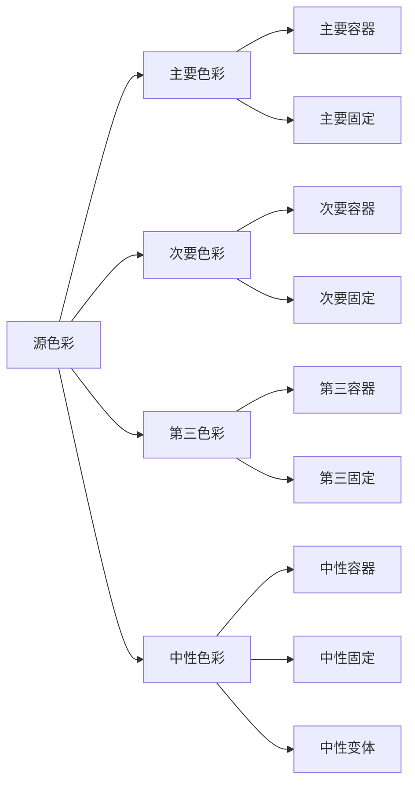
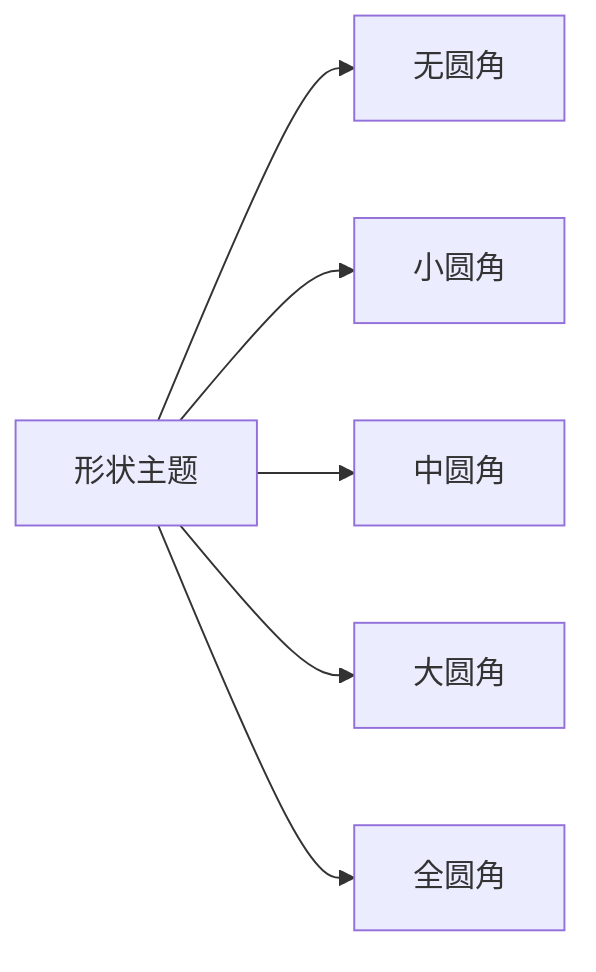

# 1Panel 移动端APP - UI设计规范

## 1. 概述

本文档详细描述了1Panel移动端APP的UI设计规范，基于Material You Design 3设计系统，旨在提供一致、美观且易用的用户界面。设计规范涵盖了色彩系统、排版、形状、组件、布局、动画和交互等方面，确保应用在不同设备和平台上都能提供出色的用户体验。

## 2. 设计原则

### 2.1 Material You Design 3 原则

1. **适应性（Adaptability）**：界面能够适应不同设备、屏幕尺寸和用户偏好。
2. **表达性（Expressiveness）**：通过动态颜色、形状和动画提供丰富的视觉体验。
3. **个性化（Personalization）**：允许用户自定义界面外观，反映个人风格。
4. **可访问性（Accessibility）**：确保所有用户都能使用应用，包括有特殊需求的用户。
5. **一致性（Consistency）**：在整个应用中保持视觉和交互的一致性。

### 2.2 1Panel APP 设计原则

1. **简洁性（Simplicity）**：界面简洁明了，避免不必要的复杂性。
2. **功能性（Functionality）**：设计服务于功能，确保用户能够高效完成任务。
3. **响应性（Responsiveness）**：界面快速响应用户操作，提供即时反馈。
4. **可预测性（Predictability）**：用户行为的结果应该可预测，减少学习成本。
5. **容错性（Forgiveness）**：设计应该防止错误发生，并在错误发生时提供恢复途径。

## 3. 色彩系统

### 3.1 动态色彩

Material You Design 3 的核心特性之一是动态色彩，它从用户的壁纸中提取颜色方案，创建个性化的配色方案。

#### 3.1.1 色彩角色



#### 3.1.2 色彩实现

在Flutter中，使用`dynamic_color`包实现动态色彩：

```dart
import 'package:dynamic_color/dynamic_color.dart';
import 'package:flutter/material.dart';

class AppTheme {
  // 1Panel的品牌蓝色作为主色调
  static const Color primaryBrandColor = Color(0xFF0854C1);
  
  static ThemeData getTheme(ColorScheme? dynamicColorScheme) {
    // 如果没有动态色彩，使用1Panel品牌色作为种子色创建颜色方案
    // Material You允许用户自定义颜色，体现个性化特点
    final colorScheme = dynamicColorScheme ?? ColorScheme.fromSeed(
      seedColor: primaryBrandColor,
    );
    
    return ThemeData(
      colorScheme: colorScheme,
      useMaterial3: true,
      // 其他主题配置
    );
  }
}```

### 3.2 静态色彩

除了动态色彩外，我们还定义了一组静态色彩，用于品牌标识和特定UI元素。

#### 3.2.1 品牌色彩

1Panel的主要色调是蓝色（品牌色），以下是品牌色彩规范：

| 色彩 | 用途 | 十六进制 | RGB |
|------|------|----------|-----|
| 主品牌色 | 主要按钮、重要元素 | #0854C1 | 8, 84, 193 |
| 辅助品牌色 | 次要按钮、装饰元素 | #03DAC6 | 3, 218, 198 |
| 强调色 | 强调、通知 | #FF4081 | 255, 64, 129 |
| 警告色 | 警告、错误 | #FFC107 | 255, 193, 7 |
| 成功色 | 成功、确认 | #4CAF50 | 76, 175, 80 |
| 错误色 | 错误、危险 | #F44336 | 244, 67, 54 |

我们保留了MDUI3的莫奈色系作为预置色彩，同时Material You允许用户自定义颜色，体现个性化特点。

#### 3.2.2 中性色彩

| 色彩 | 用途 | 十六进制 | RGB |
|------|------|----------|-----|
| 主要文本 | 主要文本、标题 | #212121 | 33, 33, 33 |
| 次要文本 | 次要文本、说明 | #757575 | 117, 117, 117 |
| 禁用文本 | 禁用元素文本 | #BDBDBD | 189, 189, 189 |
| 分割线 | 分割线、边框 | #E0E0E0 | 224, 224, 224 |
| 背景 | 页面背景 | #FFFFFF | 255, 255, 255 |
| 卡片背景 | 卡片、面板背景 | #F5F5F5 | 245, 245, 245 |

### 3.3 深色模式

深色模式使用相同的色彩角色，但调整了亮度和饱和度，以在低光环境下提供舒适的视觉体验。

#### 3.3.1 深色模式色彩

| 色彩角色 | 浅色模式 | 深色模式 |
|----------|----------|----------|
| 主要容器 | #FFDAD6 | #FFDAD6 |
| 主要固定 | #004C40 | #80CCC4 |
| 次要容器 | #D9F2EE | #D9F2EE |
| 次要固定 | #006A60 | #80DBD4 |
| 第三容器 | #E0F2F1 | #E0F2F1 |
| 第三固定 | #004D45 | #80C9C1 |
| 中性容器 | #F5F5F5 | #2A2A2A |
| 中性固定 | #1C1B1F | #E6E1E5 |
| 中性变体 | #49454F | #CAC4D0 |

#### 3.3.2 深色模式实现

```dart
class AppTheme {
  static ThemeData getDarkTheme(ColorScheme? dynamicColorScheme) {
    // 深色模式下也使用1Panel品牌色作为种子色
    final colorScheme = dynamicColorScheme ?? ColorScheme.fromSeed(
      seedColor: primaryBrandColor,
      brightness: Brightness.dark,
    );
    
    return ThemeData(
      colorScheme: colorScheme,
      useMaterial3: true,
      // 其他深色主题配置
    );
  }
}
```

## 4. 排版系统

### 4.1 字体规范

参考 Material You 设计规范，定义应用中使用的字体样式。应用字体将使用用户设备的系统字体，以提供一致的用户体验。

#### 4.1.1 字体样式

```dart
class AppTypography {
  // 使用 Material You 推荐的字体样式，不指定 fontFamily 以使用系统默认字体
  static const TextStyle headlineLarge = TextStyle(
    fontWeight: FontWeight.w400,
    fontSize: 32.0,
    letterSpacing: 0,
  );
  
  static const TextStyle headlineMedium = TextStyle(
    fontWeight: FontWeight.w400,
    fontSize: 28.0,
    letterSpacing: 0,
  );
  
  static const TextStyle headlineSmall = TextStyle(
    fontWeight: FontWeight.w400,
    fontSize: 24.0,
    letterSpacing: 0,
  );
  
  static const TextStyle titleLarge = TextStyle(
    fontWeight: FontWeight.w400,
    fontSize: 22.0,
    letterSpacing: 0,
  );
  
  static const TextStyle titleMedium = TextStyle(
    fontWeight: FontWeight.w500,
    fontSize: 16.0,
    letterSpacing: 0.15,
  );
  
  static const TextStyle titleSmall = TextStyle(
    fontWeight: FontWeight.w500,
    fontSize: 14.0,
    letterSpacing: 0.1,
  );
  
  static const TextStyle bodyLarge = TextStyle(
    fontWeight: FontWeight.w400,
    fontSize: 16.0,
    letterSpacing: 0.5,
  );
  
  static const TextStyle bodyMedium = TextStyle(
    fontWeight: FontWeight.w400,
    fontSize: 14.0,
    letterSpacing: 0.25,
  );
  
  static const TextStyle bodySmall = TextStyle(
    fontWeight: FontWeight.w400,
    fontSize: 12.0,
    letterSpacing: 0.4,
  );
  
  static const TextStyle labelLarge = TextStyle(
    fontWeight: FontWeight.w500,
    fontSize: 14.0,
    letterSpacing: 0.1,
  );
  
  static const TextStyle labelMedium = TextStyle(
    fontWeight: FontWeight.w500,
    fontSize: 12.0,
    letterSpacing: 0.5,
  );
  
  static const TextStyle labelSmall = TextStyle(
    fontWeight: FontWeight.w500,
    fontSize: 11.0,
    letterSpacing: 0.5,
  );
  
  // 代码字体保留 Roboto Mono
  static const TextStyle code = TextStyle(
    fontFamily: 'Roboto Mono',
    fontWeight: FontWeight.w400,
    fontSize: 14.0,
    letterSpacing: 0,
  );
}
```

#### 4.1.2 使用指南

- 应用中的所有文本都应使用上述定义的字体样式
- `code` 样式仅用于代码显示
- 所有其他文本样式将使用用户设备的系统字体
```

### 4.2 文本样式指南

#### 4.2.1 标题使用

| 样式 | 使用场景 | 示例 |
|------|----------|------|
| Headline Large | 页面主标题 | 仪表盘 |
| Headline Medium | 区块主标题 | 系统概览 |
| Headline Small | 子区块标题 | CPU使用率 |
| Title Large | 对话框标题 | 添加应用 |
| Title Medium | 卡片标题 | 服务器信息 |
| Title Small | 列表项标题 | Nginx |

#### 4.2.2 正文使用

| 样式 | 使用场景 | 示例 |
|------|----------|------|
| Body Large | 主要内容 | 服务器运行正常 |
| Body Medium | 次要内容 | 最后更新: 10分钟前 |
| Body Small | 辅助信息 | 版本: 1.0.0 |

#### 4.2.3 标签使用

| 样式 | 使用场景 | 示例 |
|------|----------|------|
| Label Large | 按钮文本 | 保存 |
| Label Medium | 标签文本 | 运行中 |
| Label Small | 小标签文本 | 新 |

## 5. 形状系统

### 5.1 形状主题

Material You Design 3 引入了形状主题，允许在整个应用中一致地使用圆角。

#### 5.1.1 形状类别



#### 5.1.2 形状实现

```dart
class AppShape {
  static const ShapeBorder none = RoundedRectangleBorder(
    borderRadius: BorderRadius.zero,
  );
  
  static const ShapeBorder extraSmall = RoundedRectangleBorder(
    borderRadius: BorderRadius.all(Radius.circular(4)),
  );
  
  static const ShapeBorder small = RoundedRectangleBorder(
    borderRadius: BorderRadius.all(Radius.circular(8)),
  );
  
  static const ShapeBorder medium = RoundedRectangleBorder(
    borderRadius: BorderRadius.all(Radius.circular(12)),
  );
  
  static const ShapeBorder large = RoundedRectangleBorder(
    borderRadius: BorderRadius.all(Radius.circular(16)),
  );
  
  static const ShapeBorder extraLarge = RoundedRectangleBorder(
    borderRadius: BorderRadius.all(Radius.circular(28)),
  );
  
  static const ShapeBorder full = RoundedRectangleBorder(
    borderRadius: BorderRadius.all(Radius.circular(100)),
  );
}
```

### 5.2 形状使用指南

#### 5.2.1 组件形状

| 组件 | 形状 | 圆角大小 |
|------|------|----------|
| 按钮 | 中圆角 | 12dp |
| 卡片 | 大圆角 | 16dp |
| 对话框 | 大圆角 | 28dp |
| 底部导航 | 全圆角 | 28dp |
| 标签 | 小圆角 | 8dp |
| 搜索栏 | 中圆角 | 16dp |
| 菜单 | 中圆角 | 16dp |

#### 5.2.2 形状主题应用

```dart
class AppTheme {
  static ThemeData getTheme(ColorScheme? colorScheme) {
    return ThemeData(
      colorScheme: colorScheme,
      useMaterial3: true,
      cardTheme: CardTheme(
        shape: AppShape.large,
        elevation: 1,
      ),
      elevatedButtonTheme: ElevatedButtonThemeData(
        style: ElevatedButton.styleFrom(
          shape: AppShape.medium,
        ),
      ),
      dialogTheme: DialogTheme(
        shape: AppShape.extraLarge,
      ),
      // 其他主题配置
    );
  }
}
```

## 6. 组件设计

### 6.1 导航组件

#### 6.1.1 底部导航栏

底部导航栏用于应用的主要导航，包含3-5个主要功能入口。

```dart
class AppBottomNavigationBar extends StatelessWidget {
  final int currentIndex;
  final Function(int) onTap;

  const AppBottomNavigationBar({
    super.key,
    required this.currentIndex,
    required this.onTap,
  });

  @override
  Widget build(BuildContext context) {
    return NavigationBar(
      selectedIndex: currentIndex,
      onDestinationSelected: onTap,
      destinations: const [
        NavigationDestination(
          icon: Icon(Icons.dashboard_outlined),
          selectedIcon: Icon(Icons.dashboard),
          label: '仪表盘',
        ),
        NavigationDestination(
          icon: Icon(Icons.apps_outlined),
          selectedIcon: Icon(Icons.apps),
          label: '应用',
        ),
        NavigationDestination(
          icon: Icon(Icons.storage_outlined),
          selectedIcon: Icon(Icons.storage),
          label: '容器',
        ),
        NavigationDestination(
          icon: Icon(Icons.language_outlined),
          selectedIcon: Icon(Icons.language),
          label: '网站',
        ),
        NavigationDestination(
          icon: Icon(Icons.folder_outlined),
          selectedIcon: Icon(Icons.folder),
          label: '文件',
        ),
      ],
    );
  }
}
```

#### 6.1.2 侧边抽屉

侧边抽屉用于次要导航和设置入口。

```dart
class AppDrawer extends StatelessWidget {
  const AppDrawer({super.key});

  @override
  Widget build(BuildContext context) {
    return Drawer(
      shape: AppShape.medium,
      child: ListView(
        padding: EdgeInsets.zero,
        children: [
          DrawerHeader(
            decoration: BoxDecoration(
              color: Theme.of(context).colorScheme.primaryContainer,
            ),
            child: Column(
              crossAxisAlignment: CrossAxisAlignment.start,
              children: [
                const CircleAvatar(
                  radius: 30,
                  child: Icon(Icons.person, size: 30),
                ),
                const SizedBox(height: 16),
                Text(
                  '管理员',
                  style: Theme.of(context).textTheme.titleLarge,
                ),
                Text(
                  'admin@example.com',
                  style: Theme.of(context).textTheme.bodyMedium,
                ),
              ],
            ),
          ),
          ListTile(
            leading: const Icon(Icons.backup_outlined),
            title: const Text('备份管理'),
            onTap: () {
              Navigator.pop(context);
              Navigator.pushNamed(context, '/backup');
            },
          ),
          ListTile(
            leading: const Icon(Icons.settings_outlined),
            title: const Text('设置'),
            onTap: () {
              Navigator.pop(context);
              Navigator.pushNamed(context, '/settings');
            },
          ),
          ListTile(
            leading: const Icon(Icons.help_outline),
            title: const Text('帮助'),
            onTap: () {
              Navigator.pop(context);
              Navigator.pushNamed(context, '/help');
            },
          ),
          ListTile(
            leading: const Icon(Icons.info_outline),
            title: const Text('关于'),
            onTap: () {
              Navigator.pop(context);
              Navigator.pushNamed(context, '/about');
            },
          ),
          const Divider(),
          ListTile(
            leading: const Icon(Icons.logout),
            title: const Text('退出登录'),
            onTap: () {
              Navigator.pop(context);
              // 处理退出登录
            },
          ),
        ],
      ),
    );
  }
}
```

### 6.2 卡片组件

卡片用于展示相关信息的集合，如服务器信息、应用列表等。

```dart
class AppCard extends StatelessWidget {
  final String title;
  final Widget? subtitle;
  final Widget? child;
  final Widget? trailing;
  final EdgeInsetsGeometry? padding;
  final VoidCallback? onTap;

  const AppCard({
    super.key,
    required this.title,
    this.subtitle,
    this.child,
    this.trailing,
    this.padding,
    this.onTap,
  });

  @override
  Widget build(BuildContext context) {
    return Card(
      shape: AppShape.large,
      elevation: 1,
      child: InkWell(
        borderRadius: BorderRadius.circular(16),
        onTap: onTap,
        child: Padding(
          padding: padding ?? const EdgeInsets.all(16),
          child: Column(
            crossAxisAlignment: CrossAxisAlignment.start,
            children: [
              Row(
                children: [
                  Expanded(
                    child: Text(
                      title,
                      style: Theme.of(context).textTheme.titleMedium,
                    ),
                  ),
                  if (trailing != null) trailing!,
                ],
              ),
              if (subtitle != null) ...[
                const SizedBox(height: 4),
                subtitle!,
              ],
              if (child != null) ...[
                const SizedBox(height: 16),
                child!,
              ],
            ],
          ),
        ),
      ),
    );
  }
}
```

### 6.3 按钮组件

按钮用于触发操作，根据重要性和使用场景选择不同类型的按钮。

#### 6.3.1 主要按钮

```dart
class AppPrimaryButton extends StatelessWidget {
  final String text;
  final VoidCallback? onPressed;
  final Widget? icon;
  final bool isLoading;

  const AppPrimaryButton({
    super.key,
    required this.text,
    this.onPressed,
    this.icon,
    this.isLoading = false,
  });

  @override
  Widget build(BuildContext context) {
    return ElevatedButton(
      onPressed: isLoading ? null : onPressed,
      style: ElevatedButton.styleFrom(
        shape: AppShape.medium,
        minimumSize: const Size(double.infinity, 48),
      ),
      child: isLoading
          ? const SizedBox(
              width: 24,
              height: 24,
              child: CircularProgressIndicator(
                strokeWidth: 2,
              ),
            )
          : Row(
              mainAxisAlignment: MainAxisAlignment.center,
              children: [
                if (icon != null) ...[
                  icon!,
                  const SizedBox(width: 8),
                ],
                Text(text),
              ],
            ),
    );
  }
}
```

#### 6.3.2 次要按钮

```dart
class AppSecondaryButton extends StatelessWidget {
  final String text;
  final VoidCallback? onPressed;
  final Widget? icon;

  const AppSecondaryButton({
    super.key,
    required this.text,
    this.onPressed,
    this.icon,
  });

  @override
  Widget build(BuildContext context) {
    return OutlinedButton(
      onPressed: onPressed,
      style: OutlinedButton.styleFrom(
        shape: AppShape.medium,
        minimumSize: const Size(double.infinity, 48),
      ),
      child: Row(
        mainAxisAlignment: MainAxisAlignment.center,
        children: [
          if (icon != null) ...[
            icon!,
            const SizedBox(width: 8),
          ],
          Text(text),
        ],
      ),
    );
  }
}
```

#### 6.3.3 文本按钮

```dart
class AppTextButton extends StatelessWidget {
  final String text;
  final VoidCallback? onPressed;
  final Widget? icon;

  const AppTextButton({
    super.key,
    required this.text,
    this.onPressed,
    this.icon,
  });

  @override
  Widget build(BuildContext context) {
    return TextButton(
      onPressed: onPressed,
      style: TextButton.styleFrom(
        shape: AppShape.medium,
        minimumSize: const Size(double.infinity, 48),
      ),
      child: Row(
        mainAxisAlignment: MainAxisAlignment.center,
        children: [
          if (icon != null) ...[
            icon!,
            const SizedBox(width: 8),
          ],
          Text(text),
        ],
      ),
    );
  }
}
```

### 6.4 列表组件

列表用于展示同类数据的集合，如应用列表、容器列表等。

```dart
class AppListTile extends StatelessWidget {
  final Widget? leading;
  final String title;
  final String? subtitle;
  final Widget? trailing;
  final VoidCallback? onTap;
  final EdgeInsetsGeometry? contentPadding;

  const AppListTile({
    super.key,
    this.leading,
    required this.title,
    this.subtitle,
    this.trailing,
    this.onTap,
    this.contentPadding,
  });

  @override
  Widget build(BuildContext context) {
    return ListTile(
      leading: leading,
      title: Text(
        title,
        style: Theme.of(context).textTheme.titleMedium,
      ),
      subtitle: subtitle != null
          ? Text(
              subtitle!,
              style: Theme.of(context).textTheme.bodyMedium,
            )
          : null,
      trailing: trailing,
      onTap: onTap,
      contentPadding: contentPadding,
      shape: AppShape.small,
    );
  }
}
```

### 6.5 对话框组件

对话框用于显示重要信息或收集用户输入。

```dart
class AppDialog extends StatelessWidget {
  final String title;
  final String? content;
  final Widget? contentWidget;
  final List<Widget>? actions;
  final EdgeInsetsGeometry? contentPadding;

  const AppDialog({
    super.key,
    required this.title,
    this.content,
    this.contentWidget,
    this.actions,
    this.contentPadding,
  });

  @override
  Widget build(BuildContext context) {
    return AlertDialog(
      title: Text(
        title,
        style: Theme.of(context).textTheme.headlineSmall,
      ),
      content: contentWidget ??
          (content != null
              ? Text(
                  content!,
                  style: Theme.of(context).textTheme.bodyMedium,
                )
              : null),
      actions: actions,
      contentPadding: contentPadding,
      shape: AppShape.extraLarge,
    );
  }
}
```

### 6.6 标签组件

标签用于显示状态或分类信息。

```dart
class AppTag extends StatelessWidget {
  final String text;
  final Color? backgroundColor;
  final Color? textColor;

  const AppTag({
    super.key,
    required this.text,
    this.backgroundColor,
    this.textColor,
  });

  @override
  Widget build(BuildContext context) {
    return Container(
      padding: const EdgeInsets.symmetric(horizontal: 8, vertical: 4),
      decoration: BoxDecoration(
        color: backgroundColor ??
            Theme.of(context).colorScheme.primaryContainer,
        borderRadius: BorderRadius.circular(8),
      ),
      child: Text(
        text,
        style: Theme.of(context).textTheme.labelSmall?.copyWith(
              color: textColor ?? Theme.of(context).colorScheme.onPrimaryContainer,
            ),
      ),
    );
  }
}
```

### 6.7 进度指示器组件

进度指示器用于显示操作进度或加载状态。

#### 6.7.1 线性进度指示器

```dart
class AppLinearProgressIndicator extends StatelessWidget {
  final double value;
  final String? label;
  final Color? backgroundColor;
  final Color? valueColor;

  const AppLinearProgressIndicator({
    super.key,
    required this.value,
    this.label,
    this.backgroundColor,
    this.valueColor,
  });

  @override
  Widget build(BuildContext context) {
    return Column(
      crossAxisAlignment: CrossAxisAlignment.start,
      children: [
        if (label != null) ...[
          Text(
            label!,
            style: Theme.of(context).textTheme.bodySmall,
          ),
          const SizedBox(height: 4),
        ],
        LinearProgressIndicator(
          value: value,
          backgroundColor: backgroundColor ??
              Theme.of(context).colorScheme.primaryContainer,
          valueColor: AlwaysStoppedAnimation<Color>(
            valueColor ?? Theme.of(context).colorScheme.primary,
          ),
        ),
      ],
    );
  }
}
```

#### 6.7.2 圆形进度指示器

```dart
class AppCircularProgressIndicator extends StatelessWidget {
  final double value;
  final String? label;
  final double size;
  final Color? backgroundColor;
  final Color? valueColor;

  const AppCircularProgressIndicator({
    super.key,
    required this.value,
    this.label,
    this.size = 60,
    this.backgroundColor,
    this.valueColor,
  });

  @override
  Widget build(BuildContext context) {
    return Column(
      mainAxisSize: MainAxisSize.min,
      children: [
        SizedBox(
          width: size,
          height: size,
          child: Stack(
            alignment: Alignment.center,
            children: [
              CircularProgressIndicator(
                value: value,
                backgroundColor: backgroundColor ??
                    Theme.of(context).colorScheme.primaryContainer,
                valueColor: AlwaysStoppedAnimation<Color>(
                  valueColor ?? Theme.of(context).colorScheme.primary,
                ),
                strokeWidth: size / 10,
              ),
              Text(
                '${(value * 100).toInt()}%',
                style: Theme.of(context).textTheme.labelLarge,
              ),
            ],
          ),
        ),
        if (label != null) ...[
          const SizedBox(height: 8),
          Text(
            label!,
            style: Theme.of(context).textTheme.bodySmall,
          ),
        ],
      ],
    );
  }
}
```

## 7. 布局系统

### 7.1 响应式布局

应用需要适应不同屏幕尺寸，从手机到平板电脑。

#### 7.1.1 断点定义

| 设备类型 | 屏幕宽度 | 布局列数 |
|----------|----------|----------|
| 手机（小） | < 360dp | 4列 |
| 手机（中） | 360dp - 600dp | 4列 |
| 手机（大） | 600dp - 840dp | 8列 |
| 平板（小） | 840dp - 1200dp | 12列 |
| 平板（大） | > 1200dp | 12列 |

#### 7.1.2 响应式布局实现

```dart
class ResponsiveLayout extends StatelessWidget {
  final Widget mobile;
  final Widget? tablet;
  final Widget? desktop;

  const ResponsiveLayout({
    super.key,
    required this.mobile,
    this.tablet,
    this.desktop,
  });

  static bool isMobile(BuildContext context) =>
      MediaQuery.of(context).size.width < 600;

  static bool isTablet(BuildContext context) =>
      MediaQuery.of(context).size.width >= 600 &&
      MediaQuery.of(context).size.width < 1200;

  static bool isDesktop(BuildContext context) =>
      MediaQuery.of(context).size.width >= 1200;

  @override
  Widget build(BuildContext context) {
    final size = MediaQuery.of(context).size;
    if (size.width >= 1200 && desktop != null) {
      return desktop!;
    } else if (size.width >= 600 && tablet != null) {
      return tablet!;
    } else {
      return mobile;
    }
  }
}
```

### 7.2 网格系统

使用网格系统创建一致的布局结构。

#### 7.2.1 网格实现

```dart
class AppGrid extends StatelessWidget {
  final int crossAxisCount;
  final double mainAxisSpacing;
  final double crossAxisSpacing;
  final List<Widget> children;
  final double childAspectRatio;

  const AppGrid({
    super.key,
    required this.crossAxisCount,
    this.mainAxisSpacing = 16,
    this.crossAxisSpacing = 16,
    required this.children,
    this.childAspectRatio = 1.0,
  });

  @override
  Widget build(BuildContext context) {
    return LayoutBuilder(
      builder: (context, constraints) {
        final itemWidth = (constraints.maxWidth -
                (crossAxisCount - 1) * crossAxisSpacing) /
            crossAxisCount;
        
        return GridView.builder(
          shrinkWrap: true,
          physics: const NeverScrollableScrollPhysics(),
          gridDelegate: SliverGridDelegateWithFixedCrossAxisCount(
            crossAxisCount: crossAxisCount,
            mainAxisSpacing: mainAxisSpacing,
            crossAxisSpacing: crossAxisSpacing,
            childAspectRatio: childAspectRatio,
          ),
          itemCount: children.length,
          itemBuilder: (context, index) {
            return SizedBox(
              width: itemWidth,
              child: children[index],
            );
          },
        );
      },
    );
  }
}
```

#### 7.2.2 响应式网格

```dart
class ResponsiveGrid extends StatelessWidget {
  final List<Widget> children;
  final double childAspectRatio;

  const ResponsiveGrid({
    super.key,
    required this.children,
    this.childAspectRatio = 1.0,
  });

  @override
  Widget build(BuildContext context) {
    int crossAxisCount = 2;
    
    final width = MediaQuery.of(context).size.width;
    if (width >= 1200) {
      crossAxisCount = 4;
    } else if (width >= 840) {
      crossAxisCount = 3;
    } else if (width >= 600) {
      crossAxisCount = 2;
    }
    
    return AppGrid(
      crossAxisCount: crossAxisCount,
      children: children,
      childAspectRatio: childAspectRatio,
    );
  }
}
```

### 7.3 间距系统

使用一致的间距创建视觉层次感。

#### 7.3.1 间距定义

| 间距 | 值 | 使用场景 |
|------|----|----------|
| extraSmall | 4dp | 组件内部小间距 |
| small | 8dp | 组件内部间距 |
| medium | 16dp | 组件之间间距 |
| large | 24dp | 区块之间间距 |
| extraLarge | 32dp | 页面区块间距 |
| huge | 48dp | 主要区块间距 |

#### 7.3.2 间距实现

```dart
class AppSpacing {
  static const double extraSmall = 4;
  static const double small = 8;
  static const double medium = 16;
  static const double large = 24;
  static const double extraLarge = 32;
  static const double huge = 48;
  
  static const Widget verticalExtraSmall = SizedBox(height: extraSmall);
  static const Widget verticalSmall = SizedBox(height: small);
  static const Widget verticalMedium = SizedBox(height: medium);
  static const Widget verticalLarge = SizedBox(height: large);
  static const Widget verticalExtraLarge = SizedBox(height: extraLarge);
  static const Widget verticalHuge = SizedBox(height: huge);
  
  static const Widget horizontalExtraSmall = SizedBox(width: extraSmall);
  static const Widget horizontalSmall = SizedBox(width: small);
  static const Widget horizontalMedium = SizedBox(width: medium);
  static const Widget horizontalLarge = SizedBox(width: large);
  static const Widget horizontalExtraLarge = SizedBox(width: extraLarge);
  static const Widget horizontalHuge = SizedBox(width: huge);
}
```

## 8. 动画和过渡效果

### 8.1 页面过渡

使用一致的页面过渡效果，提供流畅的用户体验。

#### 8.1.1 淡入淡出过渡

```dart
class FadePageRoute<T> extends PageRouteBuilder<T> {
  final Widget child;

  FadePageRoute({required this.child})
      : super(
          transitionDuration: const Duration(milliseconds: 300),
          reverseTransitionDuration: const Duration(milliseconds: 300),
          pageBuilder: (context, animation, secondaryAnimation) => child,
          transitionsBuilder: (context, animation, secondaryAnimation, child) {
            return FadeTransition(
              opacity: animation,
              child: child,
            );
          },
        );
}
```

#### 8.1.2 滑动过渡

```dart
class SlidePageRoute<T> extends PageRouteBuilder<T> {
  final Widget child;
  final Offset beginOffset;
  final Offset endOffset;

  SlidePageRoute({
    required this.child,
    this.beginOffset = const Offset(1.0, 0.0),
    this.endOffset = Offset.zero,
  }) : super(
          transitionDuration: const Duration(milliseconds: 300),
          reverseTransitionDuration: const Duration(milliseconds: 300),
          pageBuilder: (context, animation, secondaryAnimation) => child,
          transitionsBuilder: (context, animation, secondaryAnimation, child) {
            var tween = Tween(begin: beginOffset, end: endOffset)
                .chain(CurveTween(curve: Curves.easeInOut));
            
            return SlideTransition(
              position: animation.drive(tween),
              child: child,
            );
          },
        );
}
```

### 8.2 共享元素过渡

共享元素过渡用于在页面之间创建视觉连续性。

```dart
class HeroPageRoute<T> extends MaterialPageRoute<T> {
  HeroPageRoute({required Widget builder}) : super(builder: builder);

  @override
  Widget buildTransitions(
    BuildContext context,
    Animation<double> animation,
    Animation<double> secondaryAnimation,
    Widget child,
  ) {
    return FadeTransition(
      opacity: animation,
      child: child,
    );
  }
}
```

### 8.3 微交互动画

微交互动画用于提供即时反馈，增强用户体验。

#### 8.3.1 按钮点击动画

```dart
class AppAnimatedButton extends StatefulWidget {
  final Widget child;
  final VoidCallback? onPressed;

  const AppAnimatedButton({
    super.key,
    required this.child,
    this.onPressed,
  });

  @override
  State<AppAnimatedButton> createState() => _AppAnimatedButtonState();
}

class _AppAnimatedButtonState extends State<AppAnimatedButton>
    with SingleTickerProviderStateMixin {
  late AnimationController _controller;
  late Animation<double> _scaleAnimation;

  @override
  void initState() {
    super.initState();
    _controller = AnimationController(
      duration: const Duration(milliseconds: 100),
      vsync: this,
    );
    
    _scaleAnimation = Tween<double>(begin: 1.0, end: 0.95).animate(
      CurvedAnimation(
        parent: _controller,
        curve: Curves.easeInOut,
      ),
    );
  }

  @override
  void dispose() {
    _controller.dispose();
    super.dispose();
  }

  @override
  Widget build(BuildContext context) {
    return GestureDetector(
      onTapDown: (_) {
        _controller.forward();
      },
      onTapUp: (_) {
        _controller.reverse();
      },
      onTapCancel: () {
        _controller.reverse();
      },
      onTap: widget.onPressed,
      child: ScaleTransition(
        scale: _scaleAnimation,
        child: widget.child,
      ),
    );
  }
}
```

#### 8.3.2 列表项动画

```dart
class AppAnimatedListItem extends StatelessWidget {
  final Widget child;
  final int index;
  final int totalItems;

  const AppAnimatedListItem({
    super.key,
    required this.child,
    required this.index,
    required this.totalItems,
  });

  @override
  Widget build(BuildContext context) {
    return AnimatedBuilder(
      animation: kThemeAnimationDuration,
      builder: (context, child) {
        return TweenAnimationBuilder<double>(
          tween: Tween(begin: 0.0, end: 1.0),
          duration: Duration(
            milliseconds: 300 + (index * 100),
          ),
          curve: Curves.easeOut,
          builder: (context, value, child) {
            return Transform.translate(
              offset: Offset(0, 50 * (1 - value)),
              child: Opacity(
                opacity: value,
                child: child,
              ),
            );
          },
          child: child,
        );
      },
      child: child,
    );
  }
}
```

## 9. 适配性和可访问性

### 9.1 响应式设计

应用需要适应不同屏幕尺寸和方向。

#### 9.1.1 屏幕方向适配

```dart
class OrientationBuilder extends StatelessWidget {
  final Widget Function(BuildContext, Orientation) builder;

  const OrientationBuilder({super.key, required this.builder});

  @override
  Widget build(BuildContext context) {
    final orientation = MediaQuery.of(context).orientation;
    return builder(context, orientation);
  }
}
```

#### 9.1.2 文本缩放适配

```dart
class TextScaleFactorBuilder extends StatelessWidget {
  final Widget Function(BuildContext, double) builder;

  const TextScaleFactorBuilder({super.key, required this.builder});

  @override
  Widget build(BuildContext context) {
    final textScaleFactor = MediaQuery.of(context).textScaleFactor;
    return builder(context, textScaleFactor);
  }
}
```

### 9.2 深色模式

应用支持浅色和深色两种主题模式。

#### 9.2.1 主题切换

```dart
class ThemeProvider with ChangeNotifier {
  ThemeMode _themeMode = ThemeMode.system;

  ThemeMode get themeMode => _themeMode;

  void setThemeMode(ThemeMode themeMode) {
    _themeMode = themeMode;
    notifyListeners();
  }

  void toggleThemeMode() {
    if (_themeMode == ThemeMode.light) {
      _themeMode = ThemeMode.dark;
    } else if (_themeMode == ThemeMode.dark) {
      _themeMode = ThemeMode.light;
    } else {
      _themeMode = ThemeMode.light;
    }
    notifyListeners();
  }
}
```

#### 9.2.2 主题应用

```dart
class App extends StatelessWidget {
  const App({super.key});

  @override
  Widget build(BuildContext context) {
    return Consumer<ThemeProvider>(
      builder: (context, themeProvider, child) {
        return DynamicColorBuilder(
          builder: (lightColorScheme, darkColorScheme) {
            return MaterialApp(
              title: '1Panel',
              theme: AppTheme.getTheme(lightColorScheme),
              darkTheme: AppTheme.getDarkTheme(darkColorScheme),
              themeMode: themeProvider.themeMode,
              // 其他配置
            );
          },
        );
      },
    );
  }
}
```

### 9.3 可访问性

应用需要满足可访问性要求，确保所有用户都能使用。

#### 9.3.1 语义化标签

```dart
class AppSemantics extends StatelessWidget {
  final Widget child;
  final String? label;
  final String? hint;
  final String? value;
  final bool? increasedValue;
  final bool? decreasedValue;
  final bool? isButton;
  final bool? isLink;
  final bool? isHeader;
  final bool? isSelected;
  final bool? isChecked;
  final bool? isObscured;

  const AppSemantics({
    super.key,
    required this.child,
    this.label,
    this.hint,
    this.value,
    this.increasedValue,
    this.decreasedValue,
    this.isButton,
    this.isLink,
    this.isHeader,
    this.isSelected,
    this.isChecked,
    this.isObscured,
  });

  @override
  Widget build(BuildContext context) {
    return Semantics(
      label: label,
      hint: hint,
      value: value,
      increasedValue: increasedValue,
      decreasedValue: decreasedValue,
      button: isButton,
      link: isLink,
      header: isHeader,
      selected: isSelected,
      checked: isChecked,
      obscured: isObscured,
      child: child,
    );
  }
}
```

#### 9.3.2 无障碍焦点管理

```dart
class AppFocus extends StatelessWidget {
  final Widget child;
  final bool autofocus;
  final FocusNode? focusNode;
  final ValueChanged<bool>? onFocusChange;

  const AppFocus({
    super.key,
    required this.child,
    this.autofocus = false,
    this.focusNode,
    this.onFocusChange,
  });

  @override
  Widget build(BuildContext context) {
    return Focus(
      autofocus: autofocus,
      focusNode: focusNode,
      onFocusChange: onFocusChange,
      child: child,
    );
  }
}
```

## 10. 实现指南

### 10.1 设置Material You Design 3

在Flutter应用中启用Material You Design 3：

```dart
MaterialApp(
  title: '1Panel',
  theme: ThemeData(
    useMaterial3: true,
    // 其他主题配置
  ),
  // 其他配置
)
```

### 10.2 使用动态色彩

从用户的壁纸中提取颜色方案：

```dart
import 'package:dynamic_color/dynamic_color.dart';

class App extends StatelessWidget {
  const App({super.key});

  @override
  Widget build(BuildContext context) {
    return DynamicColorBuilder(
      builder: (lightColorScheme, darkColorScheme) {
        return MaterialApp(
          title: '1Panel',
          theme: ThemeData(
            colorScheme: lightColorScheme,
            useMaterial3: true,
          ),
          darkTheme: ThemeData(
            colorScheme: darkColorScheme,
            useMaterial3: true,
          ),
          themeMode: ThemeMode.system,
          // 其他配置
        );
      },
    );
  }
}
```

### 10.3 自定义组件

基于Material You Design 3创建自定义组件：

```dart
class AppCard extends StatelessWidget {
  final Widget child;
  final EdgeInsetsGeometry? padding;
  final Color? color;

  const AppCard({
    super.key,
    required this.child,
    this.padding,
    this.color,
  });

  @override
  Widget build(BuildContext context) {
    return Card(
      color: color ?? Theme.of(context).colorScheme.surfaceVariant,
      elevation: 0,
      shape: RoundedRectangleBorder(
        borderRadius: BorderRadius.circular(16),
      ),
      child: Padding(
        padding: padding ?? const EdgeInsets.all(16),
        child: child,
      ),
    );
  }
}
```

## 11. 设计资源

### 11.1 图标

应用使用Material Design图标，确保一致性和可识别性。

#### 11.1.1 图标使用

```dart
Icon(
  Icons.dashboard,
  color: Theme.of(context).colorScheme.onSurfaceVariant,
  size: 24,
)
```

#### 11.1.2 自定义图标

```dart
class AppIcon extends StatelessWidget {
  final IconData icon;
  final double? size;
  final Color? color;

  const AppIcon({
    super.key,
    required this.icon,
    this.size,
    this.color,
  });

  @override
  Widget build(BuildContext context) {
    return Icon(
      icon,
      size: size ?? 24,
      color: color ?? Theme.of(context).colorScheme.onSurfaceVariant,
    );
  }
}
```

### 11.2 图片

图片使用一致的样式和处理方式。

#### 11.2.1 图片加载

```dart
class AppImage extends StatelessWidget {
  final String imageUrl;
  final double? width;
  final double? height;
  final BoxFit fit;
  final Widget? placeholder;
  final Widget? errorWidget;

  const AppImage({
    super.key,
    required this.imageUrl,
    this.width,
    this.height,
    this.fit = BoxFit.cover,
    this.placeholder,
    this.errorWidget,
  });

  @override
  Widget build(BuildContext context) {
    return CachedNetworkImage(
      imageUrl: imageUrl,
      width: width,
      height: height,
      fit: fit,
      placeholder: (context, url) =>
          placeholder ?? const CircularProgressIndicator(),
      errorWidget: (context, url, error) =>
          errorWidget ?? const Icon(Icons.error),
    );
  }
}
```

#### 11.2.2 图片占位符

```dart
class AppImagePlaceholder extends StatelessWidget {
  final double? width;
  final double? height;
  final IconData icon;
  final Color? backgroundColor;
  final Color? iconColor;

  const AppImagePlaceholder({
    super.key,
    this.width,
    this.height,
    this.icon = Icons.image,
    this.backgroundColor,
    this.iconColor,
  });

  @override
  Widget build(BuildContext context) {
    return Container(
      width: width,
      height: height,
      decoration: BoxDecoration(
        color: backgroundColor ??
            Theme.of(context).colorScheme.surfaceVariant,
        borderRadius: BorderRadius.circular(8),
      ),
      child: Icon(
        icon,
        color: iconColor ?? Theme.of(context).colorScheme.onSurfaceVariant,
        size: (width ?? height ?? 48) * 0.5,
      ),
    );
  }
}
```

### 11.3 字体

应用使用思源黑体和Roboto字体，确保在不同平台上的一致性。

#### 11.3.1 字体配置

在`pubspec.yaml`中配置字体：

```yaml
flutter:
  fonts:
    - family: SourceHanSans
      fonts:
        - asset: fonts/SourceHanSans-Regular.ttf
          weight: 400
        - asset: fonts/SourceHanSans-Medium.ttf
          weight: 500
        - asset: fonts/SourceHanSans-Bold.ttf
          weight: 700
```

#### 11.3.2 字体使用

```dart
Text(
  '1Panel',
  style: TextStyle(
    fontFamily: 'SourceHanSans',
    fontWeight: FontWeight.w500,
    fontSize: 24,
    color: Theme.of(context).colorScheme.onSurface,
  ),
)
```

## 12. 最佳实践

### 12.1 设计一致性

- 在整个应用中保持一致的设计语言
- 使用相同的颜色、形状、间距和动画
- 遵循Material You Design 3的设计原则
- 确保组件在不同上下文中表现一致

### 12.2 性能优化

- 使用`const`构造函数减少重建
- 避免不必要的Widget树深度
- 使用`ListView.builder`等懒加载组件
- 优化图片加载和缓存
- 使用动画时注意性能影响

### 12.3 用户体验

- 提供即时反馈
- 使用加载指示器
- 实现错误处理和恢复
- 提供离线支持
- 确保导航清晰直观

### 12.4 测试和验证

- 在不同设备上测试UI
- 测试不同屏幕尺寸和方向
- 验证深色模式下的表现
- 测试动态色彩效果
- 进行可访问性测试

## 13. 总结

1Panel移动端APP的UI设计规范基于Material You Design 3设计系统，提供了全面的指导原则和实现方案。通过遵循这些规范，我们可以创建一个美观、一致且易用的用户界面，满足用户的需求和期望。

设计规范涵盖了色彩系统、排版、形状、组件、布局、动画和交互等方面，确保应用在不同设备和平台上都能提供出色的用户体验。同时，规范也考虑了适配性和可访问性，使应用能够服务于更广泛的用户群体。

通过遵循最佳实践和测试验证，我们可以确保应用的质量和性能，为用户提供一个功能强大且易于使用的1Panel移动端管理应用。