# Flutter App UML Diagrams for 1Panel Mobile App

## 1. Layered Architecture Diagram

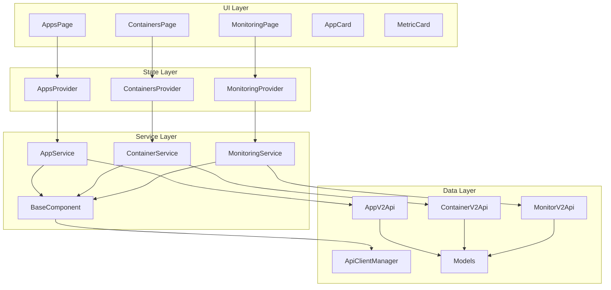

## 2. Core Class Diagram

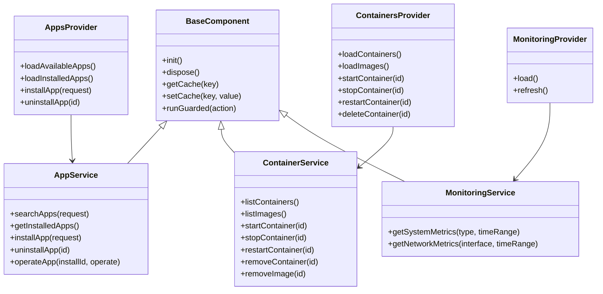

## Legacy: Class Diagram

```mermaid
classDiagram
    AppClient <|-- AuthManager
    AppClient <|-- ApiClient
    AppClient <|-- DataManager
    AppClient <|-- UIManager
    AppClient <|-- CacheManager
    AppClient <|-- WebSocketService
    
    class AppClient {
        +String baseUrl
        +String apiKey
        +initialize()
        +run()
    }
    
    class AuthManager {
        +String token
        +String refreshToken
        +login(username, password)
        +logout()
        +refreshToken()
        +generateAuthHeaders()
        +validateToken()
    }
    
    class ApiClient {
        +AuthManager authManager
        +Dio dio
        +getDashboardOverview()
        +getAppList()
        +installApp(request)
        +uninstallApp(id)
        +getContainerList()
        +startContainer(id)
        +stopContainer(id)
        +getWebsiteList()
        +createWebsite(request)
        +deleteWebsite(id)
        +getFileList(path)
        +uploadFile(path, file)
        +downloadFile(path)
        +deleteFile(path)
        +getBackupList()
        +createBackup(request)
        +restoreBackup(id)
    }
    
    class DataManager {
        +DashboardOverview dashboardOverview
        +List~App~ apps
        +List~Container~ containers
        +List~Website~ websites
        +List~FileInfo~ files
        +List~Backup~ backups
        +loadDashboardData()
        +loadAppData()
        +loadContainerData()
        +loadWebsiteData()
        +loadFileData(path)
        +loadBackupData()
        +updateData()
    }
    
    class UIManager {
        +showDashboard()
        +showAppManager()
        +showContainerManager()
        +showWebsiteManager()
        +showFileManager()
        +showBackupManager()
        +showSettings()
    }
    
    class CacheManager {
        +Map~String, CacheEntry~ cache
        +Duration cacheDuration
        +get(key)
        +put(key, data)
        +remove(key)
        +clear()
        +isExpired(key)
    }
    
    class WebSocketService {
        +IOWebSocketChannel channel
        +StreamController streamController
        +connect()
        +disconnect()
        +send(data)
        +subscribe(topic)
        +unsubscribe(topic)
    }
    
    class DashboardOverview {
        +SystemInfo system
        +CpuInfo cpu
        +MemoryInfo memory
        +DiskInfo disk
        +NetworkInfo network
    }
    
    class SystemInfo {
        +String hostname
        +String os
        +String kernel
        +String uptime
    }
    
    class CpuInfo {
        +double usage
        +int cores
        +String model
    }
    
    class MemoryInfo {
        +double usage
        +int total
        +int available
    }
    
    class DiskInfo {
        +double usage
        +int total
        +int available
    }
    
    class NetworkInfo {
        +int bytesReceived
        +int bytesSent
    }
    
    class App {
        +int id
        +String name
        +String key
        +String version
        +String status
        +String description
        +String icon
        +DateTime installTime
        +int port
        +String index
        +start()
        +stop()
        +restart()
        +update()
        +uninstall()
    }
    
    class Container {
        +String id
        +String name
        +String image
        +String status
        +String state
        +DateTime created
        +List~String~ ports
        +Map~String, String~ labels
        +start()
        +stop()
        +restart()
        +delete()
    }
    
    class Website {
        +int id
        +String primaryDomain
        +List~String~ otherDomains
        +String alias
        +String sitePath
        +String type
        +String status
        +bool ssl
        +DateTime createTime
        +DateTime updateTime
        +enableSSL()
        +disableSSL()
        +delete()
    }
    
    class FileInfo {
        +String name
        +String path
        +bool isDir
        +int size
        +DateTime modifyTime
        +String permission
        +upload(file)
        +download()
        +delete()
    }
    
    class Backup {
        +int id
        +String name
        +String type
        +String status
        +String path
        +DateTime createTime
        +int size
        +String description
        +restore()
        +delete()
    }
    
    class CacheEntry {
        +dynamic data
        +DateTime expiryTime
        +isExpired()
    }
```

## 2. Sequence Diagram - App Installation

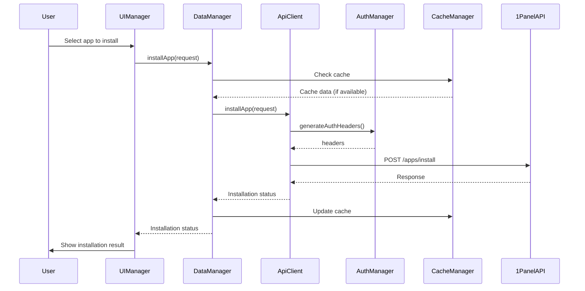

## 3. Sequence Diagram - User Login

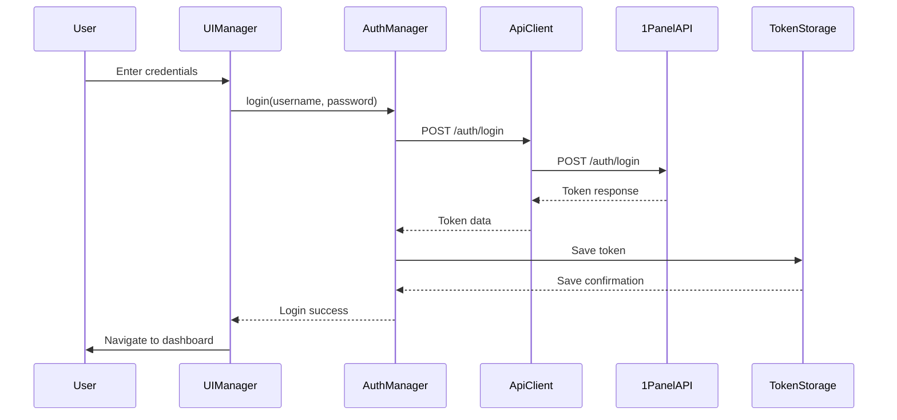

## 4. Sequence Diagram - Real-time Data Update

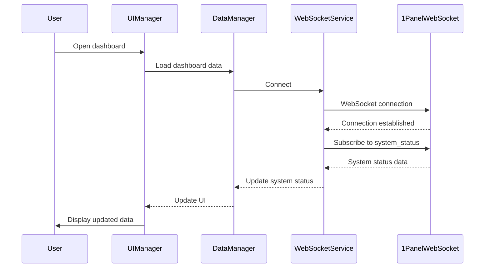

## 5. Sequence Diagram - File Upload

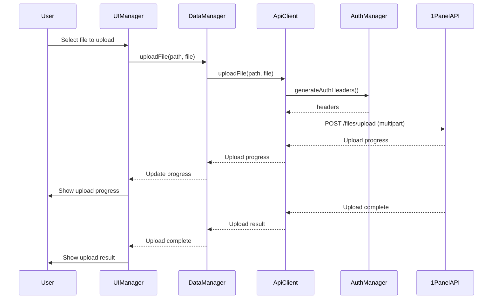

## 6. State Diagram - App Status

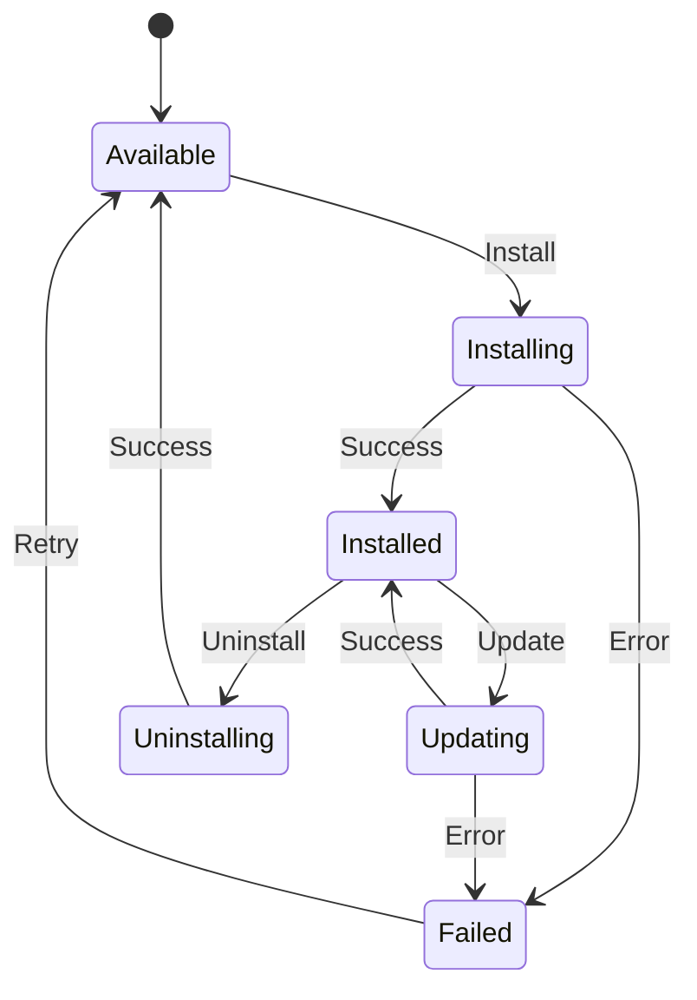

## 7. State Diagram - Container Status

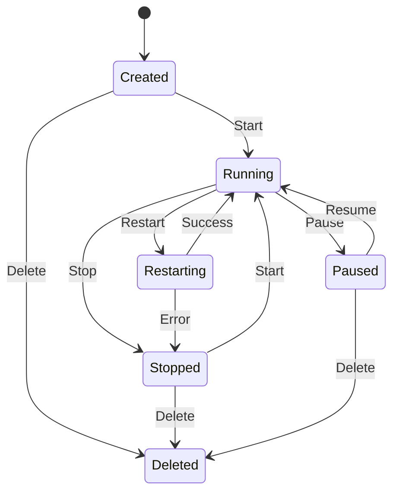

## 8. State Diagram - Website SSL Status

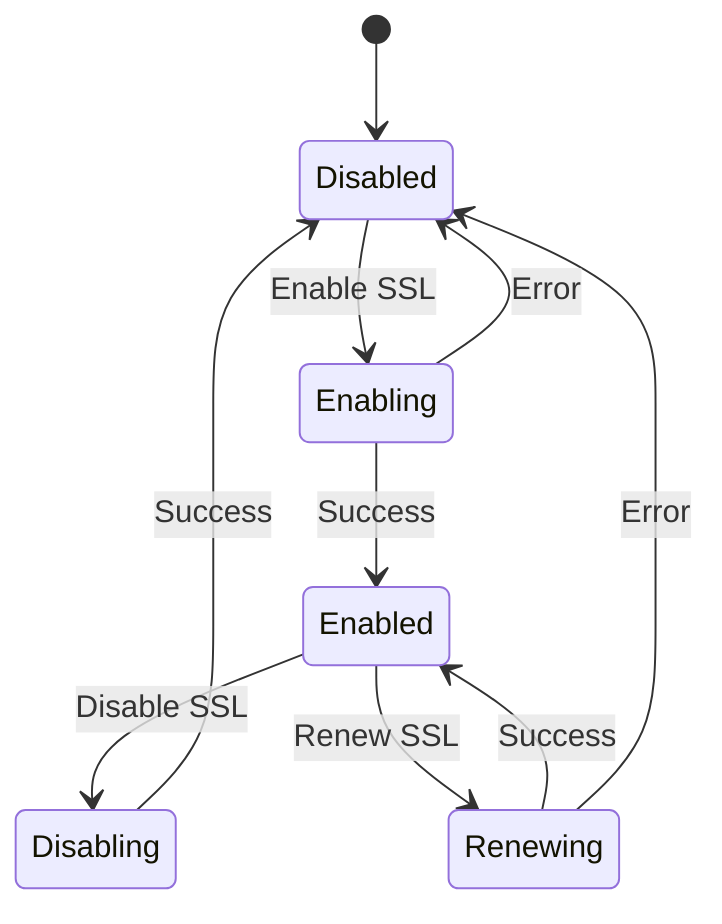

## 9. State Diagram - User Authentication

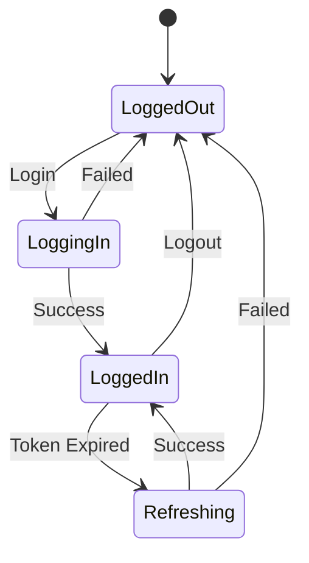

## 10. State Diagram - File Operation

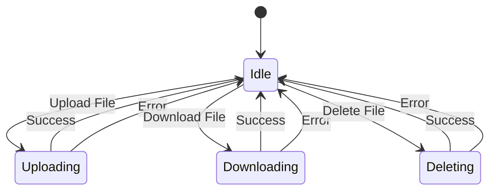

## 11. State Diagram - Backup Operation

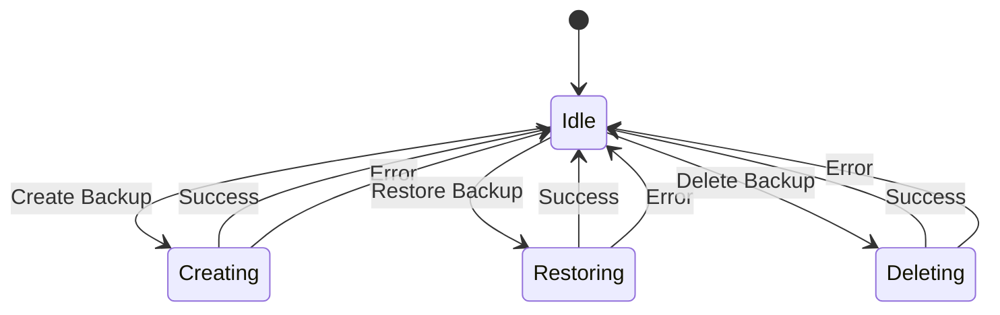

## 12. Component Diagram - App Architecture

```mermaid
componentDiagram
    [Flutter App] as App
    [Auth Module] as Auth
    [API Module] as API
    [Data Module] as Data
    [UI Module] as UI
    [Cache Module] as Cache
    [WebSocket Module] as WS
    
    App --> Auth
    App --> API
    App --> Data
    App --> UI
    App --> Cache
    App --> WS
    
    Auth --> API : Provides auth headers
    API --> Data : Fetches data
    Data --> Cache : Stores/Retrieves data
    Data --> WS : Receives real-time updates
    UI --> Data : Displays data
    UI --> Auth : Manages user sessions
    
    subgraph Authentication
        Auth
    end
    
    subgraph Data Management
        Data
        Cache
    end
    
    subgraph Communication
        API
        WS
    end
    
    subgraph User Interface
        UI
    end
```

## 13. Component Diagram - API Integration

```mermaid
componentDiagram
    [Flutter App] as App
    [Dio Client] as Dio
    [Auth Interceptor] as AuthInterceptor
    [Error Handler] as ErrorHandler
    [Cache Manager] as CacheManager
    [1Panel API] as API
    
    App --> Dio
    Dio --> AuthInterceptor
    Dio --> ErrorHandler
    Dio --> CacheManager
    Dio --> API
    
    AuthInterceptor --> CacheManager : Gets token
    ErrorHandler --> App : Reports errors
    CacheManager --> Dio : Provides cached data
    
    subgraph HTTP Client
        Dio
        AuthInterceptor
        ErrorHandler
    end
    
    subgraph Data Layer
        CacheManager
    end
    
    subgraph External Service
        API
    end
```

## 14. Deployment Diagram - App Deployment

```mermaid
deploymentDiagram
    node [Mobile Device] {
        [Flutter App] as App
        [Local Storage] as Storage
        [Network Layer] as Network
    }
    
    node [1Panel Server] {
        [1Panel API] as ServerAPI
        [WebSocket Service] as WSService
        [Database] as DB
        [File System] as FS
    }
    
    App --> Storage : Stores token/cache
    App --> Network : Makes HTTP requests
    Network --> ServerAPI : Forwards requests
    Network --> WSService : Establishes WebSocket
    ServerAPI --> DB : Reads/Writes data
    ServerAPI --> FS : Manages files
    WSService --> App : Pushes real-time updates
```

## 15. Activity Diagram - User Login Flow

```mermaid
activityDiagram
    start
    :Open app;
    :Check stored token;
    if (Valid token?) then (yes)
        :Navigate to dashboard;
    else (no)
        :Show login screen;
        :Enter credentials;
        :Validate input;
        if (Valid input?) then (yes)
            :Send login request;
            if (Login success?) then (yes)
                :Store token;
                :Navigate to dashboard;
            else (no)
                :Show error message;
                :Return to login;
            endif
        else (no)
            :Show validation error;
            :Return to login;
        endif
    endif
    stop
```

## 16. Activity Diagram - App Installation Flow

```mermaid
activityDiagram
    start
    :Navigate to app store;
    :Select app to install;
    :Show app details;
    :Configure installation;
    :Confirm installation;
    :Send install request;
    :Show installation progress;
    if (Installation success?) then (yes)
        :Show success message;
        :Navigate to app management;
    else (no)
        :Show error message;
        :Return to app store;
    endif
    stop
```

## 17. Activity Diagram - File Upload Flow

```mermaid
activityDiagram
    start
    :Navigate to file manager;
    :Select directory;
    :Click upload button;
    :Select file(s);
    if (File size valid?) then (yes)
        :Start upload;
        :Show upload progress;
        if (Upload success?) then (yes)
            :Show success message;
            :Refresh file list;
        else (no)
            :Show error message;
        endif
    else (no)
        :Show size limit error;
    endif
    stop
```
